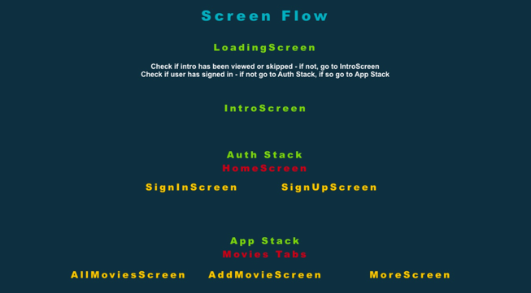

# My Solution - A Client's Ask for their Movies App

## 

#### This is an example step-by-step possible approach for a Solutions' Architect decision when a client asks for a re-design, or modernization for better security and efficiency.

### Client's Requirement: 
The client is redesigning their external member application and needs expertise in GCP or AWS, iOS and Android application performance optimization, modern API patterns and building well designed APIs.

### Solutions Architect Option #1:
Keep in mind that you need to generate different 3 options for a mobile app. Here's one of my recommendations along with the actual development.

### Some Questions You Can Ask Before Getting Started
In order for me to understand your requirements, pain points, and your needs, I have a few questions before I can get started.

### QUESTIONS for the Client
* 		Business Objectives:
    * What are the primary business goals or objectives for redesigning the external member application?
    * Are there specific Key Performance Indicators (KPIs) or success metrics that you would like the redesigned application to achieve?
* 		User Requirements:
    * Who are the primary users of the application?
    * What are the main features and functionalities that users expect from the application?
* 		Current Pain Points:
    * What are the current challenges or pain points with the existing external member application?
    * Are there specific issues reported by users that need to be addressed?
* 		Scalability and Performance:
    * What is the expected user load, and how scalable should the solution be?
    * Are there any performance benchmarks or expectations for the application?
* 		Security and Compliance:
    * What are the security requirements for user data and transactions?
    * Are there any compliance standards or regulations that the solution needs to adhere to?
* 		Integration Requirements:
    * Are there any existing systems or third-party services that the application needs to integrate with?
    * What data sources or APIs will be used to populate and update information in the application?
* 		Technology Preferences:
    * Is there a preference for using specific technologies, frameworks, or cloud providers (AWS or GCP)?
    * Are there any existing systems or technologies that need to be retained or integrated into the new solution?
* 		Budget and Timeline:
    * What is the budget allocated for the redesign project?
    * Are there any specific timelines or deadlines that need to be considered?
* 		User Experience and Design:
    * What is the desired user experience and design aesthetic for the application?
    * Are there any specific design guidelines or branding elements that should be incorporated?
* 		Maintenance and Support:
    * What are your expectations regarding ongoing maintenance and support for the application?
    * Is there an internal team responsible for maintaining the application post-launch?
* 		Training and Documentation:
    * Is there a need for user training or documentation for the application?
    * What level of documentation is expected for the development team and future maintainers?
* 		Feedback and Iteration:
    * How will user feedback be collected and incorporated into the development process?
    * Is there a preference for an iterative development approach?

### My Tech Stack Solution
React Native, AWS AppSync, AWS Amplify, AWS Cognito, GraphQL, DynamoDB.
<br>

### My Step-by-Step Approach/High-Level Guide
1. <b>Assessment:</b>
   Evaluate the current architecture and identify performance bottlenecks.
   Consider the current API design and its efficiency.
   Understand the specific requirements for the member application. 
<br><br>
2. <b>Select a Cloud Provider:</b>
   Decide whether to use GCP or AWS based on your organization's preferences, expertise, and any specific services they offer that might align with your requirements.
<br><br>
3. <b>Serverless or Containerized Architecture: </b>
   Consider using serverless computing (AWS Lambda on AWS or Cloud Functions on GCP) for scalable and event-driven components.
   Alternatively, containerized solutions (AWS ECS, EKS, or GCP Kubernetes Engine) provide more control over the infrastructure.
<br><br>
4. <b>Database Optimization: </b>
   Choose a database that suits your data structure and usage patterns (Cloud Firestore or Cloud Spanner on GCP, or Amazon DynamoDB on AWS).
   Optimize database queries and indexing for better performance.
<br><br>
5. <b>API Design: </b>
   Design RESTful or GraphQL APIs based on your application needs.
   Use API Gateway services (AWS API Gateway or Cloud Endpoints on GCP) to manage and secure APIs.
<br><br>
6. <b>Authentication and Authorization: </b>
   Implement secure authentication using OAuth or JWT.
   Use identity management services like AWS Cognito or Firebase Authentication.
<br><br>
7. <b>Caching: </b>
   Implement caching mechanisms (Cloud CDN on GCP or CloudFront on AWS) to reduce latency for frequently accessed resources.
<br><br>
8. <b>Monitoring and Logging: </b>
   Implement robust monitoring and logging using services like AWS CloudWatch or Google Cloud Monitoring.
   Utilize distributed tracing for performance analysis.
<br><br>
9. <b>CD/CI Pipeline: </b>
   Set up a continuous integration and continuous deployment (CI/CD) pipeline using tools like AWS CodePipeline or Cloud Build on GCP.
<br><br>
10. <b>Security: </b>
    Follow security best practices and use services like AWS WAF or Cloud Armor on GCP to secure your application.
<br><br>
11. <b>Scalability: </b>
    Design the architecture to scale horizontally and vertically based on demand.
    Leverage auto-scaling features provided by the cloud provider.
<br><br>
12. <b>Documentation: </b>
    Create thorough documentation for both the API and the infrastructure.
<br><br>
13. <b>Testing: </b>
    Implement unit tests, integration tests, and end-to-end tests for both the frontend and backend components.
<br><br>
14. <b>Compliance and Regulations: </b>
    Ensure compliance with relevant data protection regulations (GDPR, etc.)
<br><br>
15. <b>Cost Optimization: </b>
    Regularly monitor and optimize costs by using cost management tools provided by the cloud provider.
<br><br>
16. <b>Performance Testing: </b>
    Conduct performance testing to ensure the application can handle the expected load.
<br><br>
17. <b>CDN Integration: </b>
    Integrate a Content Delivery Network (CDN) for static content to improve latency.
<br><br>
18. <b>DevOps Practices: </b>
    Implement DevOps practices for collaboration and efficiency.
<br><br>
19. <b>Real-time Features: </b>
    If needed, consider integrating real-time features using services like AWS AppSync or Firebase Realtime Database.
<br><br>
20. <b>Feedback and Iteration: </b>
    Gather feedback from users and performance metrics to continuously iterate and improve the application.
    Remember, the specific services and tools you choose will depend on your unique requirements, budget, and team expertise. Regularly review and update your infrastructure and application to leverage new technologies and best practices.

AWS Amplify library can be modularized:
https://github.com/aws-amplify/amplify-js/wiki/Amplify-Modularization

There are some new helpers also available to reduce boilerplate code, see this article for details:
https://medium.com/open-graphql/save-hundreds-of-lines-of-code-in-your-next-graphql-app-with-this-one-weird-trick-3bef9ef0d45a



## Screenshots

### iOS


## Technology stack:

- <b>aws-amplify</b>: AWS Amplify is a set of tools and services that simplifies the development process for web and mobile applications, providing features like authentication, storage, and APIs.<br>
<br>
- <b>aws-amplify-react-native:</b>The React Native library for AWS Amplify, enabling seamless integration of AWS services into React Native applications. <br>
<br>
- <b>aws-appsync:</b> AWS AppSync is a fully managed service that makes it easy to develop GraphQL APIs, providing real-time data synchronization and offline capabilities.<br>
<br>
- <b>aws-appsync-react:</b> The React library for AWS AppSync, facilitating the integration of GraphQL APIs with React applications. <br>
  <br>
- <b>aws-sdk:</b> The AWS SDK for JavaScript allows developers to interact with various AWS services using JavaScript, both on the client-side and server-side. <br>
  <br>
- <b>graphql-tag: </b>graphql-tag is a JavaScript template literal tag that parses GraphQL queries into abstract syntax trees, making it easier to work with GraphQL queries in JavaScript code.<br>
<br>
- <b>lodash:</b> Lodash is a JavaScript utility library that provides helpful functions for common programming tasks, simplifying and enhancing code readability. <br>
<br>
- <b>moment:</b> Moment.js is a JavaScript library for parsing, validating, manipulating, and formatting dates and times. <br>
<br>
- <b>prop-types:</b> PropTypes is a library for type-checking React props, helping developers catch and fix bugs related to component prop types. <br>
<br>
- <b>react-apollo:</b> React Apollo is a React library for integrating React applications with GraphQL, making it easier to manage data fetching and state management. <br>
<br>
- <b>react-native-app-intro-slider:</b> A React Native library for implementing onboarding and introductory slides in mobile applications. <br>
<br>
- <b>react-native-elements:</b> React Native Elements is a UI toolkit for React Native applications, providing pre-designed components for faster and more consistent app development. <br>
<br>
- <b>react-native-modal:</b> A React Native library for creating modals in mobile applications, enhancing the user experience with modal pop-ups. <br>
<br>
- <b>react-native-splash-screen:</b> A React Native library for adding splash screens to mobile applications, providing a loading screen during app startup.<br>
<br>
- <b>react-native-vector-icons:</b> A React Native library for using custom vector icons in mobile applications, providing a wide range of icon sets. <br>
<br>
- <b>react-navigation:</b> React Navigation is a popular library for implementing navigation in React Native applications, offering a flexible and customizable navigation system. <br>
<br>
- <b>react-navigation-material-bottom-tabs:</b> A React Navigation extension providing a material design-style bottom tab navigator for React Native applications. <br>
<br>
- <b>react-navigation-tabs:</b> Another React Navigation extension offering tab-based navigation for React Native applications. <br>
<br>
- <b>uuid:</b> The uuid library generates unique identifiers (UUIDs) in JavaScript, commonly used for creating unique keys or IDs in applications.

## Installation

### React Native setup on a Mac:

`brew install node`  
`brew install watchman`  
`npm install -g react-native-cli`

And also install Xcode for iOS simulator + Android Studio / Genymotion for Android simulator. Alternatively connect up a hardware device.

### Project Setup:

Clone the repo:
`git clone https://github.com/girlCoder8/solutions_architect-aws_movies_app.git`  
Change to the project folder:
`cd movies_app`  
Add dependencies:
`npm install` or `yarn` (<i>preferably yarn</i>)

### Amazon

Sign up to AWS Free Tier:  
https://aws.amazon.com/free/

### AWS Mobile CLI setup

(note: you will be directed to create a new **IAM** user and prompted to enter the **accessKeyId** and **secretAccessKey**, store these in a safe place):

`npm install -g awsmobile-cli`  
`awsmobile configure`  
`awsmobile init` (<i>in the project folder</i>)


`awsmobile user-signin enable`  
`awsmobile push`  
`awsmobile console` (opens the aws console in browser)

This project's source directory is 'app'.

### AWS AppSync setup:

In the aws console **Services** section locate **AWS AppSync** and then do the following:

- select **Create API**


- enter API name **AWS Movies App** and select authorization type to **Amazon Cognito User Pool**


- select **Custom Schema**

Paste the following into the Custom Schema box:

```
type Movie {  
    id: ID!  
    title: String!  
    genre: String!  
    director: String!  
    reviews: [Review]  
    likes: Int!  
    author: String!  
    createdAt: String!  
}

type Review {  
    id: ID!  
    movieID: ID!  
    rating: Int!  
    content: String!  
    author: String!  
    createdAt: String!  
}

type Query {  
    fetchMovie(id: ID!): Movie
}

schema {  
    query: Query  
}
```

Select **Save** and then **Create Resources**, then select type **Movie** with table name **MovieTable**. Repeat the same process for type **Review** with table name **ReviewTable**.


### Update resolvers

Back in the AppSync console, find the Data Type **Movie** and **attach** a resolver to the **reviews** field, it should look like this:


Back again in the AppSync console, find the Data Type **Query** and modify resolver for the **listReviews** field, it should look like this:


### DynamoDB table index:

From your AppSync console:

- select **DataSources**
- select **ReviewTable**
- select **Create index** in DynamoDB
- select primary key **movieID**, and index name **movieID-index**
- set read and write capacity to 1 unit each


### Add AppSync configuration


Download the React Native AppSync.js file:

Add the contents of this file to **app/aws-appsync.js** as follows:

```
export default {  
    graphqlEndpoint: 'ENTER_ENDPOINT',  
    region: 'ENTER_REGION',  
    authenticationType: 'AMAZON_COGNITO_USER_POOLS',  
    apiKey: 'null',  
};
```

### AWS Cognito

In the aws console **Services** section locate **Cognito** and select **Manage User Pools**. Here you can customise the user and authorisation settings. For this project **MFA** has been set to **OPTIONAL**.


### Launch on iOS

Run on ios:
`react-native run-ios`  
Run on android:
`react-native run-android`
